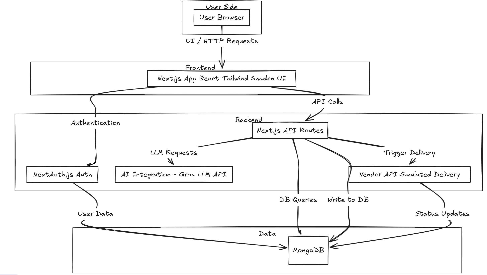

# Xeno CRM

A modern, AI-powered Customer Relationship Management (CRM) platform built with Next.js, designed to help businesses manage customers, campaigns, and orders with advanced analytics and automation.

---

## Table of Contents

- [Project Overview](#project-overview)
- [Live Demo](#live-demo)
- [Demo Video](#demo-video)
- [Features Implemented](#features-implemented)
- [Tech Stack Used](#tech-stack-used)
- [Architecture Diagram](#architecture-diagram)
- [Getting Started](#getting-started)
  - [Prerequisites](#prerequisites)
  - [Installation & Setup](#installation--setup)
- [AI Integration (Groq LLM)](#ai-integration-groq-llm)
- [Known Limitations & Assumptions](#known-limitations--assumptions)
- [Future Scope](#future-scope)

---

## Project Overview

**Xeno CRM** is a full-stack CRM solution that enables businesses to:
- Upload and manage customer and order data
- Create and track marketing campaigns
- Analyze sales and customer engagement with AI-powered insights
- Use natural language queries and AI-generated campaign messages

---

## Live Demo

[Live Demo Link](https://xeno-five.vercel.app)

---

## Demo Video

[[Watch the Demo]](https://drive.google.com/file/d/1qt9JolSImRleMlOlIaLtHJpAmHzV_AJN/view?usp=drive_link)

---

## Features Implemented

- **User Authentication:** Sign up, sign in (email/password & Google OAuth)
- **Dashboard:** Visual stats, quick actions, and campaign summaries
- **Campaign Management:** Create, filter, and track campaigns with AI-assisted message generation
- **Order Management:** Upload CSVs, preview data, and analyze product sales
- **Customer Management:** Import, filter, and manage customer data
- **AI Insights:** Use Groq LLM for natural language analytics and campaign message enhancement
- **Responsive UI:** Modern, card-based, mobile-friendly design
- **Role-based Navigation:** Dynamic navbar for authenticated and guest users
- **API Documentation (Swagger):**  
  Comprehensive and interactive API documentation is provided using the Swagger (OpenAPI) standard.  
  The `swagger.json` file describes all available endpoints, request/response schemas, and authentication methods.  
  You can view and test the API directly using [Swagger UI](https://editor.swagger.io/) by importing the `swagger.json` file from the `public` directory.
---

## Tech Stack Used

- **Frontend:** Next.js (App Router), React, Tailwind CSS, Shadcn UI, Chart.js
- **Backend:** Next.js API Routes, MongoDB, Mongoose
- **Authentication:** NextAuth.js (Credentials & Google)
- **AI Integration:** Groq LLM API
- **CSV Parsing:** PapaParse
- **Other:** React Query Builder, React Toastify

---

## Architecture Diagram





---

**🔐 Authentication:** Users log in via Google OAuth2.

**🖥️ Frontend:** UI for Dashboard, Campaign Creation, and History. Interacts with the backend to view data and trigger campaigns.

**🧠 Backend (API):** Manages campaigns, orders, customers, and delivery receipts.

**🗃️ Data Store:** MongoDB stores customers, campaigns, and message logs.

**📡 Vendor API:** Simulates message delivery and sends status updates.
  
---

## Getting Started

Follow these instructions to set up and run the project locally.

---

### Prerequisites

- **Node.js** (v18.x or later recommended)
- **npm** (v9.x or later) or **yarn**
- **MongoDB** instance (local or cloud, e.g., MongoDB Atlas)
- **Google Cloud Platform** project with OAuth 2.0 credentials enabled
- **Groq LLM API Key** (for AI features)
- *(Optional for advanced features)* **Redis** instance

---

### Environment Variables

1. Copy `.env.example` to `.env` in the project root.
2. Fill in all required values:
   - `NEXTAUTH_SECRET`
   - `NEXTAUTH_URL`
   - `GOOGLE_CLIENT_ID`
   - `GOOGLE_CLIENT_SECRET`
   - `MONGODB_URI`
   - `GROQ_API_KEY`
   - `CALLBACK_URL`

---

### Installation & Setup

1. **Clone the repository:**
   ```bash
   https://github.com/abhinav2805-ux/XENO.git
2. **Install dependencies:**
    ```bash
    npm install
3. **Run the development server:**
    ```bash
    npm run dev
    # or
    yarn dev
  ####  The app should start on http://localhost:3000.
---

## AI Integration

### AI-Driven Message Suggestions

The platform integrates with **Groq LLM** to provide AI-powered message suggestions and analytics for campaigns.

- **Campaign Message Generation:**  
  When creating a campaign, users can click a button to "Enhance Message with AI".  
  The frontend sends the campaign name, description, and user-written message to a Next.js API route (`/api/llm/suggest-message`).
- **Order/Product Insights:**  
  Users can ask natural language questions about their uploaded orders (e.g., "Which product has the maximum sales?").  
  The frontend sends the prompt and the relevant `uploadId` to `/api/llm/product-analysis`, which uses Groq LLM to generate insights.
- **How it works:**  
  The backend constructs a prompt and calls the Groq LLM API using your `GROQ_API_KEY` from `.env`.  
  The generated message or insight is returned and displayed in the UI.

---

## Known Limitations & Assumptions

- **Google Auth:**  
  Currently, Google OAuth is implemented for authentication, but account linking between Google and credentials (email/password) is not automatic. Users must use the same method they registered with.
- **AI Features:**  
  AI integration is focused on campaign message enhancement and product/order analytics. Other advanced AI use cases (e.g., natural language to segment rules, performance summarization) are not yet implemented.
- **Error Handling:**  
  Basic error handling is present, but more granular user feedback and comprehensive backend logging could be improved.


---

## Future Scope

- **Multi-Channel Delivery:**  
  Extend delivery capabilities beyond simulated SMS to include email, WhatsApp, push notifications, and in-app messages.
- **Advanced Dashboard:**  
  Build a dashboard with live tracking of campaign performance, customer engagement, and delivery heatmaps.
- **More AI Features:**  
  Integrate additional AI-powered features such as natural language to segment rules, MongoDB-powered message suggestions, and campaign performance summarization.
- **Enhanced UX/UI:**  
  Add more interactive and user-friendly elements to the interface.
- **Automated Testing:**  
  Implement comprehensive automated testing (unit, integration, end-to-end).
- **Improved Error Handling:**  
  Enhance error handling and system logging for better reliability and maintainability.

---

Thank you for checking out Xeno CRM!
